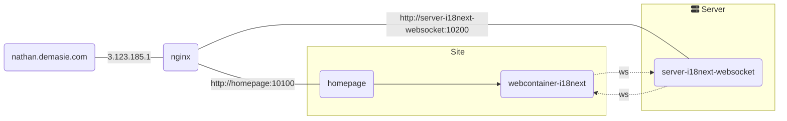

# https://nathan.demasie.com

```mermaid
flowchart LR
  pubIp("nathan.demasie.com")

  nginx(nginx)
  click nginx "https://github.com/ndemasie/ndemasie.github.io/tree/main/apps/nginx" _blank

  %% Flow
  pubIp ---|3.123.185.1|nginx
  nginx ---|http://homepage:10100|homepage
  nginx ---|http://server-i18next-websocket:10200|si18n

  wci18n -.->|ws|si18n -.->|ws|wci18n

  subgraph Site[fa:fa-browser Site]
    homepage(homepage )
    click homepage "https://github.com/ndemasie/ndemasie.github.io/tree/main/apps/homepage" _blank
    wci18n(webcontainer-i18next)
    click wci18n "https://github.com/ndemasie/ndemasie.github.io/tree/main/apps/webcontainer-i18next" _blank

    homepage --> wci18n
  end

  subgraph Server[fa:fa-server Server]
    si18n(server-i18next-websocket )
    click si18n "https://github.com/ndemasie/ndemasie.github.io/tree/main/apps/server-i18next-websocket" _blank
  end
```